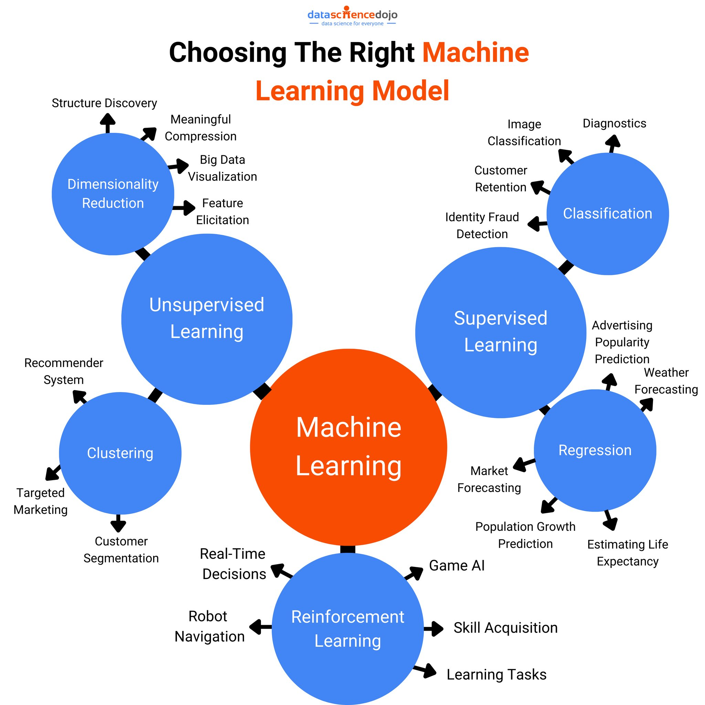

# S-K-T
Scikit-Keras-Tensor

####  01-choose model

#### 02-supervised/unsupervised algorithms 

k-NN, linear regression,logistic regression,SVMS,DT and RF,NN

clustering:K-Mean,DBSCAN,HCA,one-class SVM,Isolation Forest,PCA,Apriori

#### 03-batch/online Learning

**batch learning:**  old data + new data + old system --> new system  (automated the train/evaluate/launch process)

**online learning:**  new data  --> system

#### 04-data clean

dataframe = read_csv(data.csv, header=None)

data = dataframe.values
X, y = data[:, :-1], data[:, -1]
print(X.shape, y.shape)

X_train, X_test, y_train, y_test = train_test_split(X, y, test_size=0.33, random_state=1)

#### 05-stratified sample

housing["income_cat"] = pd.cut(housing["median_income"], bins = [0,1,3,4,6,np.inf], labels = [1,2,3,4,5])

housing["income_cat"].hist()

from sklearn.model_selection import StratifiedShuffleSplit 

split = StratifiedShuffleSplit(n_splits=1, test_size=0.2, random_state=42)

for train_index, test_index in split.split(housing, housing["income_cat"]):

​    strat_train_set = housing.loc[train_index]

​    strat_test_set = housing.loc[test_index]

strat_test_set["income_cat"].value_counts() / len(strat_test_set)

#### 06-K-Fold cross validation

from sklearn.model_selection import cross_val_score 

scores = cross_val_score(tree_reg, housing_prepared, housing_labels,scoring="neg_mean_squared_error", cv=10)

tree_rmse_scores = np.sqrt(-scores)

def display_scores(scores):

​    print("Scores:", scores)

​    print("Mean:", scores.mean())

​    print("Standard deviation:", scores.std())

display_scores(tree_rmse_scores)
